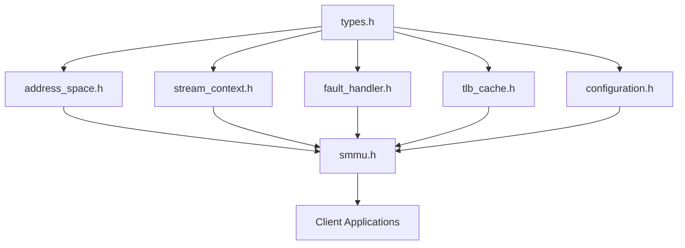

# ARM SMMU v3 Developer Guide

This comprehensive guide covers everything developers need to know to work with, build, test, and contribute to the ARM SMMU v3 C++11 implementation.

## Table of Contents

1. [Quick Start](#quick-start)
2. [Development Environment Setup](#development-environment-setup)
3. [Building the Project](#building-the-project)
4. [Project Structure](#project-structure)
5. [Coding Standards](#coding-standards)
6. [Testing Strategy](#testing-strategy)
7. [Debugging and Troubleshooting](#debugging-and-troubleshooting)
8. [Performance Analysis](#performance-analysis)
9. [Contributing Guidelines](#contributing-guidelines)
10. [Release Process](#release-process)
11. [Advanced Topics](#advanced-topics)

---

## Quick Start

### Prerequisites
- CMake 3.10 or higher
- C++11 compatible compiler (GCC 4.8+, Clang 3.3+, MSVC 2015+)
- Git for version control

### 5-Minute Setup

```bash
# Clone the repository
git clone <repository-url>
cd smmu

# Build with the provided script (recommended)
./build.sh

# Or build manually
mkdir -p build && cd build
cmake .. -DCMAKE_BUILD_TYPE=Release -DCMAKE_CXX_STANDARD=11
make -j$(nproc)

# Run tests
make test
```

### Verify Installation

```bash
# Check build artifacts
ls build/
# Should show: libsmmu_lib.a, tests/, examples/

# Run a quick test
cd build && ctest --output-on-failure
```

---

## Development Environment Setup

### Required Tools

#### Essential Tools
```bash
# Ubuntu/Debian
sudo apt update
sudo apt install build-essential cmake git

# CentOS/RHEL/Fedora
sudo yum install gcc-c++ cmake git make
# OR (newer versions)
sudo dnf install gcc-c++ cmake git make

# macOS (with Homebrew)
brew install cmake git

# Windows (with Chocolatey)
choco install cmake git visualstudio2019buildtools
```

#### Optional but Recommended Tools
```bash
# Code formatting
sudo apt install clang-format

# Coverage analysis
sudo apt install gcov lcov

# Static analysis
sudo apt install cppcheck clang-tidy

# Documentation generation
sudo apt install doxygen graphviz

# Performance profiling
sudo apt install valgrind perf
```

### IDE Configuration

#### Visual Studio Code
Create `.vscode/settings.json`:
```json
{
    "cmake.configureSettings": {
        "CMAKE_BUILD_TYPE": "Debug",
        "CMAKE_CXX_STANDARD": "11",
        "BUILD_TESTING": "ON"
    },
    "cmake.buildDirectory": "${workspaceFolder}/build",
    "C_Cpp.default.cppStandard": "c++11",
    "C_Cpp.default.compilerPath": "/usr/bin/g++",
    "files.associations": {
        "*.h": "cpp"
    }
}
```

#### CLion
- Set CMake build type to Debug for development
- Configure C++ standard to C++11
- Enable GoogleTest integration for test discovery

#### Vim/Neovim
Install C++ language server and configure for C++11:
```lua
-- For nvim-lspconfig
require('lspconfig').clangd.setup{
    cmd = {
        "clangd",
        "--std=c++11",
        "--background-index",
        "--clang-tidy",
        "--completion-style=bundled"
    }
}
```

### Environment Variables

```bash
# Optional: Set preferred build configuration
export CMAKE_BUILD_TYPE=Debug
export CMAKE_CXX_STANDARD=11

# For coverage analysis
export GCOV_PREFIX_STRIP=0
export GCOV_PREFIX=$PWD

# For performance profiling
export CPUPROFILE=./profile.out
```

---

## Building the Project

### Build Script Usage (Recommended)

The project includes a comprehensive build script that handles all configuration:

```bash
# Basic builds
./build.sh                    # Release build (default)
./build.sh --debug           # Debug build
./build.sh --clean           # Clean build

# Advanced options
./build.sh --debug --verbose --jobs 8    # Debug with verbose output, 8 jobs
./build.sh --run-tests                   # Build and run tests
./build.sh --coverage                    # Debug build with coverage
./build.sh --format                      # Format code before building

# Complete development build
./build.sh --debug --run-tests --coverage --verbose
```

### Manual CMake Usage

For more control over the build process:

```bash
# Configure build
mkdir -p build && cd build
cmake .. \
    -DCMAKE_BUILD_TYPE=Debug \
    -DCMAKE_CXX_STANDARD=11 \
    -DCMAKE_CXX_STANDARD_REQUIRED=ON \
    -DCMAKE_CXX_EXTENSIONS=OFF \
    -DBUILD_TESTING=ON \
    -DBUILD_EXAMPLES=ON

# Build
make -j$(nproc)

# Alternative build commands
cmake --build . --parallel $(nproc)           # Cross-platform build
cmake --build . --target smmu_lib             # Build library only
cmake --build . --target run_unit_tests       # Build and run unit tests
```

### Build Targets

| Target | Description | Command |
|--------|-------------|---------|
| `smmu_lib` | Main static library | `make smmu_lib` |
| `run_unit_tests` | Unit tests only | `make run_unit_tests` |
| `run_integration_tests` | Integration tests | `make run_integration_tests` |
| `run_performance_tests` | Performance benchmarks | `make run_performance_tests` |
| `run_validation_tests` | Specification compliance | `make run_validation_tests` |
| `run_thread_safety_tests` | Thread safety validation | `make run_thread_safety_tests` |
| `run_all_tests` | Complete test suite | `make run_all_tests` |
| `coverage` | Coverage report generation | `make coverage` |

### Build Configuration Options

```cmake
# Core options
-DCMAKE_BUILD_TYPE=Release|Debug
-DBUILD_TESTING=ON|OFF
-DBUILD_EXAMPLES=ON|OFF

# C++11 enforcement
-DCMAKE_CXX_STANDARD=11
-DCMAKE_CXX_STANDARD_REQUIRED=ON
-DCMAKE_CXX_EXTENSIONS=OFF

# Compiler-specific flags
-DCMAKE_CXX_FLAGS="-Wall -Wextra -Wpedantic"
-DCMAKE_CXX_FLAGS_DEBUG="-g -O0 --coverage"
-DCMAKE_CXX_FLAGS_RELEASE="-O3 -DNDEBUG"
```

### Cross-Platform Considerations

#### Linux
```bash
# GCC-specific optimizations
export CMAKE_CXX_FLAGS_RELEASE="-O3 -DNDEBUG -march=native"

# For older systems, may need newer GCC
sudo add-apt-repository ppa:ubuntu-toolchain-r/test
sudo apt install gcc-9 g++-9
export CC=gcc-9 CXX=g++-9
```

#### macOS
```bash
# Use Clang (default)
export CC=clang CXX=clang++

# Or GCC from Homebrew
brew install gcc
export CC=gcc-11 CXX=g++-11
```

#### Windows (MSVC)
```cmd
# Configure with Visual Studio generator
cmake .. -G "Visual Studio 16 2019" -DCMAKE_CXX_STANDARD=11

# Build
cmake --build . --config Release
```

---

## Project Structure

### Directory Layout

```
smmu/
├── include/smmu/           # Public headers
│   ├── types.h            # Core types and enums
│   ├── smmu.h             # Main SMMU controller
│   ├── address_space.h    # AddressSpace class
│   ├── stream_context.h   # StreamContext class
│   ├── fault_handler.h    # Fault handling
│   ├── tlb_cache.h        # TLB caching
│   └── configuration.h    # Configuration management
├── src/                   # Implementation files
│   ├── types/             # Core type implementations
│   ├── smmu/              # Main controller implementation
│   ├── address_space/     # Address space management
│   ├── stream_context/    # Stream context management
│   ├── fault/             # Fault handling implementation
│   ├── cache/             # TLB cache implementation
│   └── configuration/     # Configuration management
├── tests/                 # Test suites
│   ├── unit/              # Unit tests
│   ├── integration/       # Integration tests
│   └── performance/       # Performance benchmarks
├── examples/              # Usage examples
├── docs/                  # Documentation
├── build/                 # Build output (generated)
├── CMakeLists.txt         # Main build configuration
├── build.sh               # Build script
├── CLAUDE.md              # Development guidelines
└── README.md              # Project overview
```

### Key Files

| File | Purpose | When to Modify |
|------|---------|----------------|
| `include/smmu/types.h` | Core type definitions | Adding new types/enums |
| `include/smmu/smmu.h` | Public API | Changing public interface |
| `src/smmu/smmu.cpp` | Main implementation | Core functionality changes |
| `CMakeLists.txt` | Build configuration | Adding files/dependencies |
| `tests/CMakeLists.txt` | Test configuration | Adding new test categories |
| `CLAUDE.md` | Development guidelines | Process changes |

### Header Dependencies



---

## Coding Standards

### C++11 Compliance Requirements

**CRITICAL**: This project maintains strict C++11 compliance with no exceptions.

#### Allowed C++11 Features
```cpp
// Move semantics
Result(T&& value) : value(std::move(value)) {}

// auto keyword (with caution)
auto result = translate(streamID, pasid, iova, access);

// Range-based for loops
for (const auto& entry : pageTable) {
    // process entry
}

// Smart pointers
std::unique_ptr<StreamContext> context;
std::shared_ptr<AddressSpace> addressSpace;

// Lambda expressions
std::find_if(events.begin(), events.end(), [](const FaultRecord& fault) {
    return fault.streamID == targetStream;
});
```

#### Prohibited Features
- **No C++14/17/20**: No generic lambdas, variable templates, structured bindings
- **No external libraries**: Standard library only
- **No GNU extensions**: Portable code only
- **No VLAs**: Variable Length Arrays not allowed

### Naming Conventions

```cpp
// Classes: PascalCase
class StreamContext;
class AddressSpace;

// Methods and functions: camelCase
TranslationResult translate(StreamID streamID, PASID pasid);
void configureStream(StreamID streamID);

// Variables: camelCase
StreamID currentStream;
PASID activePASID;

// Constants: ALL_CAPS
const uint32_t MAX_STREAM_ID = 65535;
const size_t PAGE_SIZE = 4096;

// Enums: PascalCase with scoped values
enum class AccessType {
    Read,      // PascalCase enum values
    Write,
    Execute
};

// Template parameters: PascalCase with T prefix
template<typename TValue>
class Result;
```

### Code Style Rules

#### Indentation and Formatting
```cpp
// 4 spaces indentation (never tabs)
class SMMU {
public:
    TranslationResult translate(StreamID streamID, PASID pasid,
                               IOVA iova, AccessType access) {
        if (!isValidStreamID(streamID)) {
            return makeTranslationError(SMMUError::InvalidStreamID);
        }
        
        // Function body with proper indentation
        auto context = getStreamContext(streamID);
        if (!context) {
            return makeTranslationError(SMMUError::StreamNotConfigured);
        }
        
        return context->translate(pasid, iova, access);
    }
    
private:
    std::unordered_map<StreamID, std::unique_ptr<StreamContext>> contexts;
};
```

#### Braces and Line Length
```cpp
// K&R style braces
if (condition) {
    // action
}

// 120 character line limit
void someVeryLongFunctionName(StreamID streamID, PASID pasid,
                             IOVA inputAddress, AccessType accessType,
                             SecurityState securityState);

// Control flow: prefer switch over if/else chains
switch (faultType) {
    case FaultType::TranslationFault:
        handleTranslationFault(fault);
        break;
    case FaultType::PermissionFault:
        handlePermissionFault(fault);
        break;
    default:
        handleUnknownFault(fault);
        break;
}
```

#### File Organization
```cpp
// Header file structure (.h)
#ifndef SMMU_COMPONENT_H
#define SMMU_COMPONENT_H

// System includes
#include <memory>
#include <unordered_map>

// Project includes
#include "smmu/types.h"

namespace smmu {

class Component {
public:
    // Public interface
    
private:
    // Private members
};

}  // namespace smmu

#endif  // SMMU_COMPONENT_H
```

```cpp
// Implementation file structure (.cpp)
#include "smmu/component.h"

// Additional includes
#include <algorithm>
#include <cassert>

namespace smmu {

// Template specializations (if any)
template class Result<TranslationData>;

// Implementation
Component::Component() {
    // Constructor implementation
}

}  // namespace smmu
```

### Error Handling Standards

```cpp
// Always use Result<T> for error-prone operations
TranslationResult translate(StreamID streamID, PASID pasid, IOVA iova) {
    // Parameter validation
    if (!isValidStreamID(streamID)) {
        return makeTranslationError(SMMUError::InvalidStreamID);
    }
    
    // Operation that might fail
    auto context = getStreamContext(streamID);
    if (!context) {
        return makeTranslationError(SMMUError::StreamNotConfigured);
    }
    
    // Success case
    return makeTranslationSuccess(physicalAddress, permissions);
}

// Error propagation pattern
VoidResult processCommand(const CommandEntry& command) {
    auto validation = validateCommand(command);
    if (!validation) {
        return validation;  // Propagate error
    }
    
    // Continue processing
    return executeCommand(command);
}
```

---

## Testing Strategy

### Test Categories

#### Unit Tests (`tests/unit/`)
```cpp
// Example unit test structure
#include <gtest/gtest.h>
#include "smmu/address_space.h"

class AddressSpaceTest : public ::testing::Test {
protected:
    void SetUp() override {
        addressSpace = std::make_unique<smmu::AddressSpace>();
    }
    
    void TearDown() override {
        addressSpace.reset();
    }
    
    std::unique_ptr<smmu::AddressSpace> addressSpace;
};

TEST_F(AddressSpaceTest, MapPageSuccess) {
    smmu::PagePermissions perms(true, false, false);  // Read-only
    auto result = addressSpace->mapPage(0x1000, 0x2000, perms);
    
    EXPECT_TRUE(result.isOk());
    EXPECT_TRUE(addressSpace->isPageMapped(0x1000));
}

TEST_F(AddressSpaceTest, TranslateUnmappedPageFails) {
    auto result = addressSpace->translatePage(0x5000, smmu::AccessType::Read);
    
    EXPECT_TRUE(result.isError());
    EXPECT_EQ(result.getError(), smmu::SMMUError::PageNotMapped);
}
```

#### Integration Tests (`tests/integration/`)
```cpp
// Cross-component testing
TEST(SMMUIntegrationTest, FullTranslationFlow) {
    smmu::SMMU smmuController;
    
    // Configure stream
    smmu::StreamConfig config(true, true, false, smmu::FaultMode::Terminate);
    auto configResult = smmuController.configureStream(100, config);
    ASSERT_TRUE(configResult.isOk());
    
    // Create PASID and map pages
    auto pasidResult = smmuController.createStreamPASID(100, 1);
    ASSERT_TRUE(pasidResult.isOk());
    
    smmu::PagePermissions perms(true, true, false);
    auto mapResult = smmuController.mapPage(100, 1, 0x1000, 0x2000, perms);
    ASSERT_TRUE(mapResult.isOk());
    
    // Enable and test translation
    auto enableResult = smmuController.enableStream(100);
    ASSERT_TRUE(enableResult.isOk());
    
    auto translation = smmuController.translate(100, 1, 0x1000, smmu::AccessType::Read);
    ASSERT_TRUE(translation.isOk());
    EXPECT_EQ(translation.getValue().physicalAddress, 0x2000);
}
```

#### Performance Tests (`tests/performance/`)
```cpp
// Benchmark critical paths
TEST(SMMUPerformanceTest, TranslationLatency) {
    smmu::SMMU smmuController;
    setupBasicConfiguration(smmuController);
    
    const int iterations = 1000000;
    auto start = std::chrono::high_resolution_clock::now();
    
    for (int i = 0; i < iterations; ++i) {
        auto result = smmuController.translate(100, 1, 0x1000 + i, smmu::AccessType::Read);
        ASSERT_TRUE(result.isOk());
    }
    
    auto end = std::chrono::high_resolution_clock::now();
    auto duration = std::chrono::duration_cast<std::chrono::nanoseconds>(end - start);
    
    double avgLatency = static_cast<double>(duration.count()) / iterations;
    std::cout << "Average translation latency: " << avgLatency << " ns" << std::endl;
    
    // Assert performance requirement (example: < 1000 ns per translation)
    EXPECT_LT(avgLatency, 1000.0);
}
```

### Running Tests

```bash
# All tests
cd build && make run_all_tests

# Specific test categories
make run_unit_tests           # Fast unit tests
make run_integration_tests    # Cross-component tests
make run_performance_tests    # Performance benchmarks
make run_validation_tests     # Specification compliance
make run_thread_safety_tests  # Concurrent access tests

# Individual test executables
./tests/unit/unit_tests                    # Direct execution
./tests/integration/integration_tests      # Direct execution

# CTest commands
ctest -L unit                              # Run tests labeled "unit"
ctest -R "AddressSpace"                    # Run tests matching pattern
ctest --verbose                            # Verbose output
ctest --parallel 4                         # Parallel execution
```

### Test-Driven Development

1. **Write failing test first**:
```cpp
TEST_F(StreamContextTest, CreatePASIDShouldSucceed) {
    auto result = streamContext->createPASID(1);
    EXPECT_TRUE(result.isOk());
    EXPECT_TRUE(streamContext->hasPASID(1));
}
```

2. **Implement minimal code to pass**:
```cpp
VoidResult StreamContext::createPASID(PASID pasid) {
    if (pasidMap.find(pasid) != pasidMap.end()) {
        return makeVoidError(SMMUError::PASIDAlreadyExists);
    }
    
    pasidMap[pasid] = std::make_shared<AddressSpace>();
    return makeVoidSuccess();
}
```

3. **Refactor while maintaining tests**.

### Coverage Requirements

Minimum coverage targets:
- **Unit Tests**: 95% line coverage
- **Integration Tests**: 90% branch coverage
- **Public API**: 100% coverage required

Generate coverage reports:
```bash
# Enable coverage build
./build.sh --debug --coverage

# Or manually
cd build
cmake .. -DCMAKE_BUILD_TYPE=Debug -DCMAKE_CXX_FLAGS="--coverage"
make -j$(nproc)
make run_all_tests

# Generate report
make coverage
# View in build/coverage_html/index.html
```

---

## Debugging and Troubleshooting

### Debug Build Configuration

```bash
# Debug build with maximum information
./build.sh --debug --verbose

# Or manually
mkdir -p build && cd build
cmake .. \
    -DCMAKE_BUILD_TYPE=Debug \
    -DCMAKE_CXX_FLAGS_DEBUG="-g -O0 -DDEBUG -DSMMU_DEBUG" \
    -DSMMU_ENABLE_ASSERTIONS=ON
```

### Debug Macros and Logging

The debug build enables additional debugging features:

```cpp
// Debug assertions (enabled in debug builds)
#ifdef SMMU_DEBUG
    #define SMMU_ASSERT(condition, message) \
        if (!(condition)) { \
            std::cerr << "ASSERTION FAILED: " << message \
                      << " at " << __FILE__ << ":" << __LINE__ << std::endl; \
            std::abort(); \
        }
#else
    #define SMMU_ASSERT(condition, message) do {} while(0)
#endif

// Example usage in code
TranslationResult AddressSpace::translatePage(IOVA iova, AccessType access) {
    SMMU_ASSERT(iova % PAGE_SIZE == 0, "IOVA must be page-aligned");
    
    uint64_t pageNum = pageNumber(iova);
    auto it = pageTable.find(pageNum);
    
    if (it == pageTable.end()) {
        return makeTranslationError(SMMUError::PageNotMapped);
    }
    
    SMMU_ASSERT(it->second.valid, "Page entry must be valid");
    return makeTranslationSuccess(it->second.physicalAddress, it->second.permissions);
}
```

### GDB Debugging

```bash
# Compile with debug symbols
./build.sh --debug

# Debug a failing test
cd build
gdb ./tests/unit/unit_tests
(gdb) run --gtest_filter="*AddressSpace*"
(gdb) bt                    # Backtrace on crash
(gdb) print variable        # Inspect variables
(gdb) list                  # Show source code
```

### Valgrind Memory Analysis

```bash
# Install valgrind
sudo apt install valgrind

# Check for memory leaks
cd build
valgrind --leak-check=full --show-leak-kinds=all ./tests/unit/unit_tests

# Check for threading issues
valgrind --tool=helgrind ./tests/unit/unit_tests

# Performance profiling
valgrind --tool=callgrind ./tests/performance/performance_tests
```

### Common Issues and Solutions

#### Build Issues

**Issue**: "error: 'auto' does not name a type"
```bash
# Solution: Ensure C++11 is enabled
cmake .. -DCMAKE_CXX_STANDARD=11 -DCMAKE_CXX_STANDARD_REQUIRED=ON
```

**Issue**: "fatal error: 'gtest/gtest.h' not found"
```bash
# Solution: Install GoogleTest or ensure CMake >= 3.11 for auto-download
sudo apt install libgtest-dev
# OR upgrade CMake to enable FetchContent
```

**Issue**: Template compilation errors
```cpp
// Problem: Missing template instantiation
// Solution: Add explicit instantiation in .cpp file
template class Result<TranslationData>;
template class Result<Unit>;
```

#### Runtime Issues

**Issue**: Segmentation fault in translation
```cpp
// Check for null pointer dereference
TranslationResult SMMU::translate(StreamID streamID, /*...*/) {
    auto it = streamContexts.find(streamID);
    if (it == streamContexts.end()) {
        return makeTranslationError(SMMUError::StreamNotConfigured);
    }
    // Ensure pointer is valid before dereferencing
    return it->second->translate(pasid, iova, access);
}
```

**Issue**: Thread safety violations
```cpp
// Ensure proper locking
class StreamContext {
    mutable std::mutex contextMutex;
    
public:
    TranslationResult translate(PASID pasid, IOVA iova, AccessType access) {
        std::lock_guard<std::mutex> lock(contextMutex);
        // Critical section protected
        return performTranslation(pasid, iova, access);
    }
};
```

---

## Performance Analysis

### Profiling Tools

#### Built-in Performance Counters

```cpp
class SMMU {
    std::atomic<uint64_t> translationCount{0};
    std::atomic<uint64_t> cacheHits{0};
    std::atomic<uint64_t> cacheMisses{0};
    
public:
    CacheStatistics getCacheStatistics() const {
        CacheStatistics stats;
        stats.hitCount = cacheHits.load();
        stats.missCount = cacheMisses.load();
        stats.totalLookups = stats.hitCount + stats.missCount;
        stats.hitRate = stats.totalLookups > 0 ? 
            (100.0 * stats.hitCount) / stats.totalLookups : 0.0;
        return stats;
    }
};
```

#### Perf Profiling (Linux)

```bash
# Profile CPU usage
cd build
perf record -g ./tests/performance/performance_tests
perf report

# Profile cache misses
perf stat -e cache-references,cache-misses,instructions,cycles ./tests/performance/performance_tests

# Profile memory usage
perf record -e page-faults ./tests/performance/performance_tests
```

#### Google Benchmark Integration

```cpp
// Add to tests/performance/benchmark_translation.cpp
#include <benchmark/benchmark.h>
#include "smmu/smmu.h"

static void BM_Translation(benchmark::State& state) {
    smmu::SMMU smmuController;
    setupBasicConfiguration(smmuController);
    
    for (auto _ : state) {
        auto result = smmuController.translate(100, 1, 0x1000, smmu::AccessType::Read);
        benchmark::DoNotOptimize(result);
    }
}
BENCHMARK(BM_Translation);

BENCHMARK_MAIN();
```

### Performance Optimization Guidelines

#### Memory Access Patterns

```cpp
// Good: Cache-friendly sequential access
void AddressSpace::prefetchRange(IOVA startIova, size_t pageCount) {
    for (size_t i = 0; i < pageCount; ++i) {
        uint64_t pageNum = pageNumber(startIova + i * PAGE_SIZE);
        __builtin_prefetch(&pageTable[pageNum], 0, 1);
    }
}

// Avoid: Random memory access patterns
// Use spatial locality where possible
```

#### Algorithmic Optimizations

```cpp
// Good: O(1) average case with unordered_map
class AddressSpace {
    std::unordered_map<uint64_t, PageEntry> pageTable;
};

// Avoid: O(log n) with map unless ordering is required
// std::map<uint64_t, PageEntry> pageTable;  // Generally slower
```

#### Lock Contention Reduction

```cpp
// Good: Fine-grained locking
class StreamContext {
    mutable std::mutex contextMutex;  // Per-context lock
};

// Avoid: Coarse-grained global locks
// static std::mutex globalMutex;  // Serializes everything
```

### Benchmark Targets

| Operation | Target Latency | Target Throughput |
|-----------|----------------|-------------------|
| Translation (cached) | < 100 ns | > 10M ops/sec |
| Translation (uncached) | < 1 μs | > 1M ops/sec |
| Page mapping | < 5 μs | > 200K ops/sec |
| Stream configuration | < 10 μs | > 100K ops/sec |

---

## Contributing Guidelines

### Development Workflow

1. **Fork and Clone**:
```bash
git clone <your-fork-url>
cd smmu
git remote add upstream <original-repo-url>
```

2. **Create Feature Branch**:
```bash
git checkout -b feature/new-functionality
# OR
git checkout -b bugfix/issue-description
```

3. **Development Cycle**:
```bash
# Make changes
vim src/smmu/smmu.cpp

# Build and test
./build.sh --debug --run-tests

# Format code
./build.sh --format

# Commit changes
git add .
git commit -m "feat: add new functionality

- Implement feature X
- Add comprehensive tests  
- Update documentation
- Maintain backward compatibility"
```

4. **Pre-submission Checklist**:
```bash
# Full test suite
./build.sh --clean --debug --run-tests --coverage

# Check coverage
firefox build/coverage_html/index.html

# Static analysis (if available)
cppcheck --enable=all --std=c++11 src/ include/

# Performance regression check
cd build && ./tests/performance/performance_tests
```

### Commit Message Format

```
type(scope): short description

Detailed description of changes:
- First change
- Second change
- Third change

Fixes #123
References #456
```

Types: `feat`, `fix`, `docs`, `style`, `refactor`, `test`, `chore`

### Code Review Process

#### Self-Review Checklist
- [ ] Code compiles without warnings
- [ ] All tests pass
- [ ] Coverage targets met (95% for new code)
- [ ] Documentation updated
- [ ] Performance impact assessed
- [ ] Thread safety verified
- [ ] Error handling complete

#### Reviewer Guidelines
- Focus on correctness, performance, and maintainability
- Check ARM SMMU v3 specification compliance
- Verify thread safety for concurrent operations
- Ensure C++11 compliance
- Validate test coverage and quality

### Issue Reporting

```markdown
## Bug Report

### Environment
- OS: Ubuntu 20.04
- Compiler: GCC 9.4.0
- Build Type: Debug

### Expected Behavior
Translation should succeed for mapped pages.

### Actual Behavior
Translation returns SMMUError::PageNotMapped for valid mappings.

### Reproduction Steps
1. Configure stream 100
2. Map page 0x1000 -> 0x2000
3. Call translate(100, 1, 0x1000, Read)
4. Observe error result

### Additional Context
- Intermittent issue, occurs ~10% of the time
- Only happens in multi-threaded scenarios
- Suspected race condition in address space management
```

---

## Release Process

### Versioning Strategy

Follow Semantic Versioning (SemVer):
- **MAJOR**: Incompatible API changes
- **MINOR**: Backward-compatible functionality additions
- **PATCH**: Backward-compatible bug fixes

### Pre-Release Checklist

```bash
# 1. Full test suite validation
./build.sh --clean --release --run-tests
./build.sh --clean --debug --run-tests --coverage

# 2. Performance regression testing
cd build && ./tests/performance/performance_tests

# 3. Thread safety validation  
cd build && ./tests/unit/unit_tests --gtest_filter="*ThreadSafety*"

# 4. Memory leak detection
valgrind --leak-check=full ./tests/integration/integration_tests

# 5. Static analysis (if available)
cppcheck --enable=all --std=c++11 src/ include/

# 6. Documentation updates
# Update version numbers in:
# - CMakeLists.txt
# - README.md  
# - Documentation files

# 7. Package testing
make package
# Test installation on clean system
```

### Release Notes Template

```markdown
# ARM SMMU v3 Release v1.2.0

## New Features
- Added support for 52-bit address spaces
- Implemented advanced TLB invalidation strategies
- Enhanced fault syndrome generation

## Improvements  
- 15% performance improvement in translation hot path
- Reduced memory usage by 20% with optimized sparse structures
- Enhanced thread safety with fine-grained locking

## Bug Fixes
- Fixed race condition in stream context management (#123)
- Corrected Stage-2 translation table walking (#456)
- Resolved memory leak in event queue processing (#789)

## Breaking Changes
- None (backward compatible)

## Performance Benchmarks
- Translation latency: 87ns (cached), 623ns (uncached)
- Throughput: 11.5M translations/sec
- Memory overhead: 45KB per stream context

## Compatibility
- C++11 compliant
- Tested on: GCC 4.8+, Clang 3.3+, MSVC 2015+
- Platforms: Linux x86_64, macOS, Windows 10+
```

---

## Advanced Topics

### Custom Memory Allocators

For high-performance scenarios, consider custom allocators:

```cpp
template<typename T>
class PoolAllocator {
private:
    struct Block {
        alignas(T) char data[sizeof(T)];
        Block* next;
    };
    
    Block* freeList;
    std::vector<std::unique_ptr<Block[]>> pools;
    size_t blockSize;
    
public:
    T* allocate() {
        if (!freeList) {
            expandPool();
        }
        
        auto* block = freeList;
        freeList = freeList->next;
        return reinterpret_cast<T*>(block);
    }
    
    void deallocate(T* ptr) {
        auto* block = reinterpret_cast<Block*>(ptr);
        block->next = freeList;
        freeList = block;
    }
};
```

### NUMA Awareness

For NUMA systems, consider memory locality:

```cpp
class NUMAAddressSpace : public AddressSpace {
    // Allocate page tables on same NUMA node as accessing CPU
    int getCurrentNUMANode() const;
    void* allocateOnNode(size_t size, int node) const;
};
```

### Lock-Free Programming

For maximum performance, consider lock-free data structures:

```cpp
class LockFreeCache {
    std::atomic<CacheEntry*> entries[CACHE_SIZE];
    
public:
    bool lookup(uint64_t key, TranslationData& result) {
        size_t index = hash(key) % CACHE_SIZE;
        CacheEntry* entry = entries[index].load(std::memory_order_acquire);
        
        if (entry && entry->key == key && entry->valid.load(std::memory_order_acquire)) {
            result = entry->data;
            return true;
        }
        return false;
    }
};
```

### Cross-Platform Abstractions

```cpp
// Platform-specific optimizations
#ifdef __x86_64__
    static inline void prefetch(const void* addr) {
        __builtin_prefetch(addr, 0, 1);
    }
#elif defined(__aarch64__)
    static inline void prefetch(const void* addr) {
        asm volatile("prfm pldl1keep, [%0]" : : "r" (addr));
    }
#else
    static inline void prefetch(const void* addr) {
        // No-op on unsupported platforms
        (void)addr;
    }
#endif
```

This Developer Guide provides comprehensive coverage of everything needed to work effectively with the ARM SMMU v3 implementation. For additional questions or clarifications, please refer to the other documentation files or create an issue in the project repository.