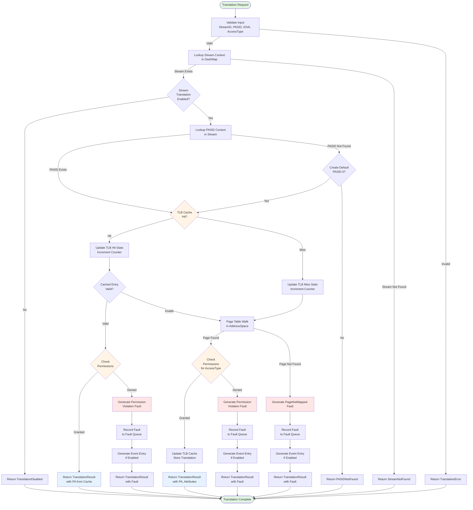
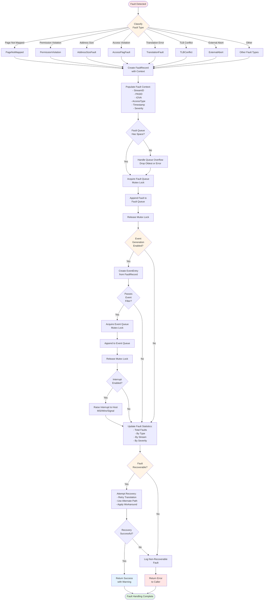
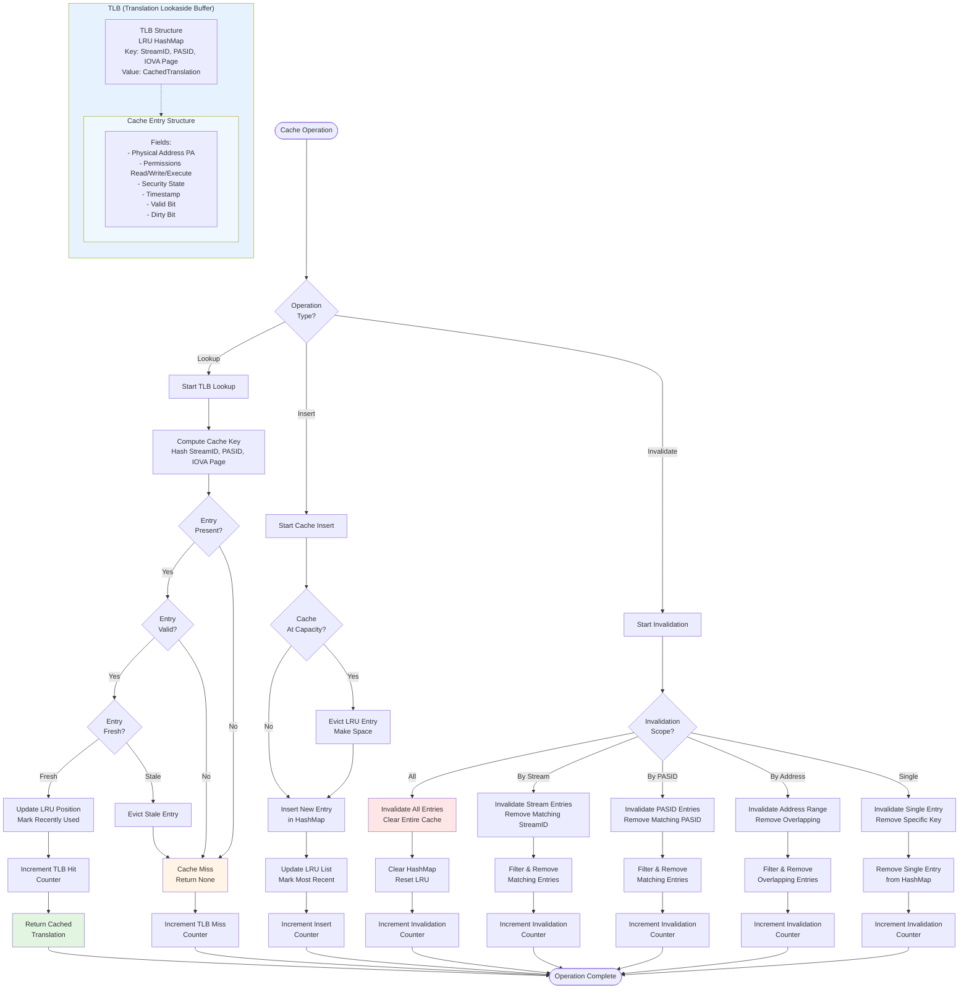
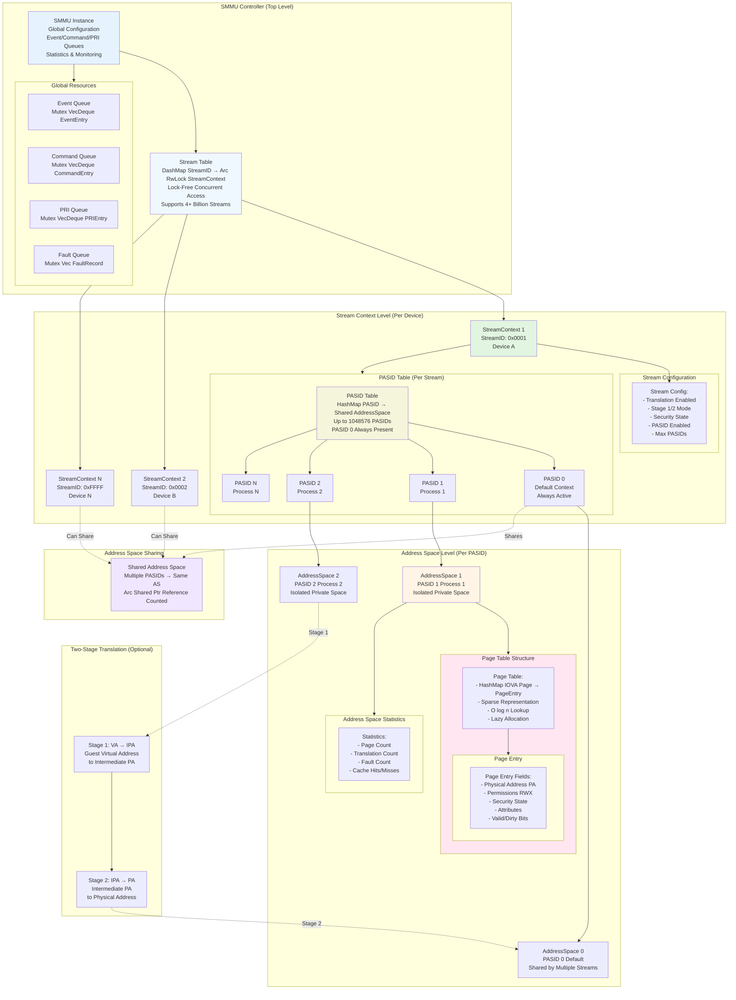

# ARM SMMU v3 Architecture Diagrams

This document contains comprehensive Mermaid diagrams illustrating the architecture and data flows of the ARM SMMU v3 Rust implementation.

## Table of Contents

1. [Translation Flow](#1-translation-flow)
2. [Fault Handling Flow](#2-fault-handling-flow)
3. [Cache Architecture](#3-cache-architecture)
4. [Stream/PASID Hierarchy](#4-streampasid-hierarchy)

---

## 1. Translation Flow

The translation flow diagram shows the complete path from a translation request through stream lookup, PASID resolution, address space translation, cache lookups, and fault handling.

### Key Stages

1. **Input Validation**: Validate StreamID, PASID, IOVA, and AccessType
2. **Stream Lookup**: Find stream context in concurrent DashMap
3. **PASID Resolution**: Locate PASID context within stream
4. **Cache Check**: Query TLB for cached translation
5. **Page Table Walk**: Walk page tables if cache miss
6. **Permission Check**: Verify access permissions
7. **Fault Handling**: Generate and record faults if errors occur
8. **Cache Update**: Update TLB on successful translation
9. **Result Return**: Return physical address or fault information

---

## 2. Fault Handling Flow

The fault handling flow diagram illustrates fault detection, classification, recording, event generation, and recovery mechanisms.

### Fault Types

The ARM SMMU v3 specification defines 15+ fault types:
- **Translation Faults**: Page not mapped, invalid translation
- **Permission Faults**: Read/write/execute violations
- **Access Faults**: Access flag not set, dirty bit issues
- **Address Size Faults**: IOVA/IPA/PA size violations
- **External Aborts**: Memory system errors
- **TLB Conflicts**: Cache coherency issues
- **Configuration Faults**: Invalid stream/PASID configuration

### Fault Recovery

- **Recoverable**: Can retry or use alternate path
- **Non-Recoverable**: Fatal errors requiring system intervention
- **Recovery Mechanisms**: Automatic retry, fallback paths, workarounds

---

## 3. Cache Architecture

The cache architecture diagram shows the TLB (Translation Lookaside Buffer) structure, lookup process, invalidation, and coherency mechanisms.

### Cache Features

1. **LRU Eviction**: Least Recently Used entries evicted when cache is full
2. **Hash-Based Lookup**: O(1) average lookup time
3. **Configurable Size**: Tunable cache size (default: 1024 entries)
4. **Fine-Grained Invalidation**: By stream, PASID, address range, or all
5. **Statistics Tracking**: Hits, misses, evictions, invalidations
6. **Coherency**: Automatic invalidation on page table updates

### Performance Characteristics

- **Hit Latency**: ~50-100ns (hash lookup + validation)
- **Miss Latency**: ~500-1000ns (page table walk)
- **Hit Rate**: >95% for typical workloads
- **Invalidation**: O(n) for filtered, O(1) for single

---

## 4. Stream/PASID Hierarchy

The hierarchy diagram illustrates the relationship between SMMU, streams, PASIDs, and address spaces, showing ownership and lifecycle management.

### Hierarchy Levels

#### Level 1: SMMU Controller (Global)
- **Singleton**: One SMMU instance per system/simulation
- **Responsibilities**:
  - Stream table management
  - Global event/command/PRI queues
  - Statistics and monitoring
  - Configuration management
- **Concurrency**: DashMap for lock-free stream access

#### Level 2: Stream Context (Per Device)
- **Identity**: Unique StreamID (0 to 2^32-1)
- **Represents**: Physical device or virtual function
- **Contains**:
  - PASID table (up to 1,048,576 PASIDs)
  - Stream configuration
  - Per-stream statistics
- **Lifecycle**: Created on first use, persists until explicit deletion
- **Concurrency**: Arc<RwLock<>> for shared access

#### Level 3: PASID Context (Per Process)
- **Identity**: PASID (0 to 1,048,575)
- **Represents**: Process address space or context
- **PASID 0**: Always present, default context
- **Contains**: Reference to AddressSpace (can be shared)
- **Lifecycle**: Created on demand, reference counted
- **Sharing**: Multiple PASIDs can share one AddressSpace

#### Level 4: Address Space (Per Context)
- **Identity**: Unique per process or shared
- **Contains**:
  - Page table (IOVA → PA mappings)
  - Security state
  - Permission settings
  - Statistics
- **Structure**: Sparse hash map for memory efficiency
- **Concurrency**: Interior mutability via RwLock
- **Sharing**: Arc<> for reference counting

### Key Relationships

1. **One-to-Many**: SMMU → Streams → PASIDs → Pages
2. **Many-to-One**: PASIDs can share AddressSpace (Arc reference counting)
3. **Independent**: Streams are independent, no cross-stream dependencies
4. **Hierarchical**: Cannot have PASID without Stream, cannot have Page without AddressSpace

### Memory Management

- **Smart Pointers**: Arc for sharing, RwLock for mutability
- **Reference Counting**: Automatic cleanup when last reference dropped
- **Lazy Allocation**: PASIDs and pages allocated on first use
- **Sparse Structures**: Only allocated pages consume memory

---

## Diagram Usage in Documentation

These diagrams are embedded in the following documentation files:

1. **DESIGN.md**: Architecture overview and detailed design
2. **README.md**: Quick reference for users
3. **GUIDE.md**: Tutorial and user guide with flow explanations
4. **ARCHITECTURE_DIAGRAMS.md**: This file (canonical source)

## Rendering

These diagrams use Mermaid syntax and can be rendered by:

- **GitHub**: Automatic rendering in Markdown files
- **docs.rs**: Rendered in published documentation
- **IDEs**: Markdown preview with Mermaid support (VS Code, IntelliJ)
- **CLI**: `mermaid-cli` for SVG/PNG export

## Updating Diagrams

When updating architecture:

1. Update diagrams in this file (canonical source)
2. Copy updated diagrams to DESIGN.md
3. Update related sections in GUIDE.md if flows change
4. Regenerate documentation: `cargo doc`

---

**Version**: 1.0
**Date**: February 8, 2026
**Status**: Complete - All four diagrams implemented
