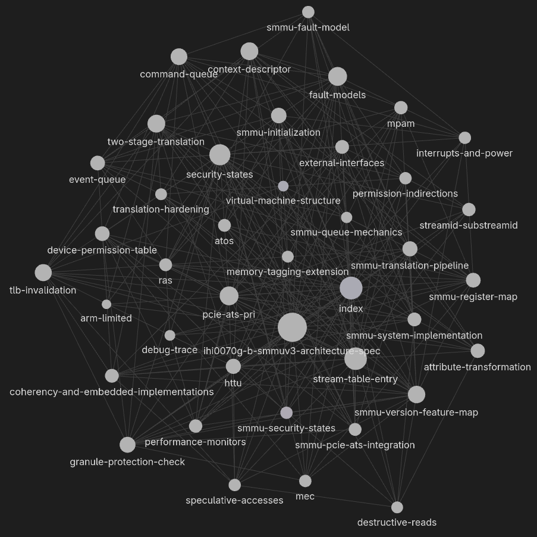

# Wiki Index

_Last updated: 2026-04-15 | Pages: 40_

# Graph View

## Sources
| Page | Summary | Date | Tags |
|------|---------|------|------|
| [sources/ihi0070g-b-smmuv3-architecture-spec.md](sources/ihi0070g-b-smmuv3-architecture-spec.md) | Arm SMMUv3 Architecture Specification v G.b — definitive reference for SMMUv3.0–3.4, RME, RME DA | 2026-04-07 | smmu, arm, iommu, virtualization, security, rme, pcie |

## Entities
| Page | Type | Summary |
|------|------|---------|
| [entities/arm-limited.md](entities/arm-limited.md) | org | Semiconductor IP company; author of the SMMUv3 specification |

## Concepts
| Page                                   | Summary                                                                                                    |
| -------------------------------------- | ---------------------------------------------------------------------------------------------------------- |
| [concepts/two-stage-translation.md](concepts/two-stage-translation.md)     | VA→IPA (stage 1) and IPA→PA (stage 2) translation pipeline; §3.4.1 UAS/VAS/TBI three-category rules; §3.4 stage 1/2 address checks with F_TRANSLATION and F_ADDR_SIZE conditions; §3.4.3 SMMU-originated access CONSTRAINED UNPREDICTABLE table |
| [concepts/stream-table-entry.md](concepts/stream-table-entry.md)        | Per-stream configuration structure (STE); stream table formats, Config encoding, stage 2 fields            |
| [concepts/context-descriptor.md](concepts/context-descriptor.md)        | Stage 1 translation configuration (CD); TTB0/TTB1, ASID, fault flags, validity conditions                  |
| [concepts/streamid-substreamid.md](concepts/streamid-substreamid.md)      | Device identification (StreamID) and process identification (SubstreamID/PASID) for SMMU lookup            |
| [concepts/command-queue.md](concepts/command-queue.md)             | §4.8 command consumption summary table; §3.5.6.1 ECMDQ parallel consumption and inter-queue no-ordering; §3.5.6.2 ECMDQ EN/ENACK enable-disable toggle handshake; §3.5.6.3 ECMDQ ERR toggle-protocol and CMDQP_ERR reporting |
| [concepts/event-queue.md](concepts/event-queue.md)               | §7.2.1 three writability conditions and four stall-event retry behaviors; §7.2.2 synchronous vs asynchronous external abort; §7.2.3 Security-state queue independence; §7.3 32-byte record format with all common fields (RnW, PnU, InD, InputAddr, SSV, S2, CLASS, NSIPA, GPCF); §7.3.1 MEV and four always-mergeable events |
| [concepts/fault-models.md](concepts/fault-models.md)              | Terminate and Stall fault models; §3.12.3 stall termination guarantee; §3.12.4 three paging models (terminate/stall/ATS-PRI); §3.12.4.1 E_PAGE_REQUEST hint; §3.12.5 four-combination Terminate/Stall table with hypervisor behavior |
| [concepts/security-states.md](concepts/security-states.md)           | Non-secure, Secure, Realm, Root states; independent queues/tables; SEC_SID disambiguation                  |
| [concepts/granule-protection-check.md](concepts/granule-protection-check.md)  | RME GPC/GPT — §3.25.1 client-originated accesses; §3.25.1.1 NoStreamID devices; §3.25.1.2 speculative/hint behavior; §3.25.2 ATS interactions; §3.25.3 SMMU-originated GPCF reporting; §3.25.4 GPF vs GPT-lookup-error fault categories; §3.25.5 active-fault behavior; §3.25.6 observability and CMD_SYNC guarantees |
| [concepts/pcie-ats-pri.md](concepts/pcie-ats-pri.md)              | PCIe ATS/PRI — Translation Requests, Translated transactions, STE.EATS, ATC invalidation, CXL              |
| [concepts/tlb-invalidation.md](concepts/tlb-invalidation.md)          | TLB entry tagging (ASID/VMID/ASET/StreamWorld), command-based and broadcast invalidation, BBM levels, TLB conflict, config invalidation completion, 7-step/4-step structure update procedures |
| [concepts/smmu-initialization.md](concepts/smmu-initialization.md)       | Reset state; 5-step initialization sequence; §3.11 SMMU_S_INIT.INV_ALL behavior (CONSTRAINED UNPREDICTABLE conditions, RME/GPCEN constraint, Non-secure access rules); Realm init via Root firmware; SMMUEN/CR0ACK handshake |
| [concepts/httu.md](concepts/httu.md)                      | HTTU — §3.13.1 software update procedure; §3.13.2 AF hardware update; §3.13.3 DPS (DBM) and IPS dirty state schemes; §3.13.4 CMD_SYNC/TLB-invalidation visibility rules; §3.13.5 two-stage interaction; §3.13.6 HAFT table descriptor AF; §3.13.7.1-7.2 ATS/PRI HTTU; §3.13.8 CMO/Destructive Read exceptions |
| [concepts/device-permission-table.md](concepts/device-permission-table.md)   | DPT — §3.24.1 VMID-match check table and PA-space determination; §3.24.2 TLB caching and Device Access fault rules; §3.24.3 two-level descriptor format (L0 NoAccess/Block/Table, L1 two-granule/contiguous); §3.24.4 8-priority lookup error table; §3.24.5 maintenance; §3.24.6 software guidance (invalid-to-valid, valid-to-invalid procedures); §3.24.7 split-stage vs full-ATS+DPT trade-offs |
| [concepts/virtual-machine-structure.md](concepts/virtual-machine-structure.md) | VMS — §5.6 field list (PARTID_MAP 32×16-bit physical PARTID array); §5.6.1 presence conditions and F_VMS_FETCH on speculative access abort; §5.6.2 dual-indexed caching (StreamID and VMID) and dual-invalidation requirement |
| [concepts/permission-indirections.md](concepts/permission-indirections.md)   | S1PIE/S2PIE/S2POE — §3.26.1 S1PIE: control hierarchy (S1PI/STE.S1PIE/CD.PIE) and 4-step permission computation; §3.26.2 S2PIE/S2POE: 5-row control table with ILLEGAL case, 5-step stage-2 computation order; PIR/POR 16×4-bit format; S2PIE-with-S2POE=1-without-S2PIE is C_BAD_STE |
| [concepts/translation-hardening.md](concepts/translation-hardening.md)     | THE/AssuredOnly — Protected attribute and AssuredOnly permission checks (SMMUv3.4 / FEAT_THE)               |
| [concepts/atos.md](concepts/atos.md)                      | Address Translation Operations — software-accessible ATOS/VATOS facility for debug and lookup               |
| [concepts/performance-monitors.md](concepts/performance-monitors.md)      | PMCG — Performance Monitor Counter Groups; architected events, StreamID/PARTID filtering, overflow/capture  |
| [concepts/debug-trace.md](concepts/debug-trace.md)               | Debug and trace — IMPLEMENTATION DEFINED debug; mandatory Security state isolation constraints               |
| [concepts/ras.md](concepts/ras.md)                       | RAS — Reliability/Availability/Serviceability; error classification, SFM, RAS registers, event mapping      |
| [concepts/attribute-transformation.md](concepts/attribute-transformation.md)  | Attribute transformation — how MT/SH/RA/WA/TR/INST/PRIV/NS are combined and overridden per transaction path |
| [concepts/mpam.md](concepts/mpam.md)                      | MPAM — Memory System Resource Partitioning and Monitoring; PARTID/PMG assignment rules (SMMUv3.2+)         |
| [concepts/mec.md](concepts/mec.md)                       | MEC — Memory Encryption Contexts; MECID assignment for Realm PA space (RME DA only)                        |
| [concepts/speculative-accesses.md](concepts/speculative-accesses.md)      | Speculative transactions — write always abort+no-event; read abort-without-event on fault; speculative TRs  |
| [concepts/coherency-and-embedded-implementations.md](concepts/coherency-and-embedded-implementations.md) | COHACC; HTTU atomicity; client coherency; embedded preset tables/queues; STE/queue field storage rules |
| [concepts/interrupts-and-power.md](concepts/interrupts-and-power.md)      | MSI/wired interrupts; 13 interrupt sources; MSI synchronization fences; power-off conditions; Dormant state |
| [concepts/memory-tagging-extension.md](concepts/memory-tagging-extension.md)  | MTE MAIR 0xF0 Reserved; SMMU accesses are Tag Unchecked; FEAT_MTE_PERM stage 2 MemAttr reinterpretation    |
| [concepts/external-interfaces.md](concepts/external-interfaces.md)       | Ch. 14 ingress/egress sideband signals (StreamID, SEC_SID, AT, NS); port coherency; SMMU-originated PCIe transactions and deadlock risk |
| [concepts/destructive-reads.md](concepts/destructive-reads.md)         | §3.22 RCI/DR/W-DCP/NW-DCP transaction classes; STE.DRE/DCP downgrade controls; permissions model; AMBA AXI5 Shareability constraints (SMMUv3.1+) |

## Analyses
| Page | Summary | Date |
|------|---------|------|

_No analyses yet._

## Synthesis
| Page                                     | Summary                                                                                                | Updated    |
| ---------------------------------------- | ------------------------------------------------------------------------------------------------------ | ---------- |
| [synthesis/smmu-translation-pipeline.md](synthesis/smmu-translation-pipeline.md)  | Step-by-step procedural description of the full SMMU transaction translation pipeline; Ch. 15 flowchart prose equivalent and ATS response categories | 2026-04-13 |
| [synthesis/smmu-queue-mechanics.md](synthesis/smmu-queue-mechanics.md)       | Complete implementation reference for SMMU circular buffer queues (Command, Event, PRI, ECMDQ); §3.5.6.3 ECMDQ ERR toggle protocol and ERRACK recovery | 2026-04-14 |
| [synthesis/smmu-fault-model.md](synthesis/smmu-fault-model.md)           | Complete fault detection, event recording, stall/terminate behavior, GERROR toggle handshake, and ordering guarantees | 2026-04-13 |
| [synthesis/smmu-security-states.md](synthesis/smmu-security-states.md)       | Multi-security-state model reference: SEC_SID, Secure EL2, Realm, Root, independent operation          | 2026-04-07 |
| [synthesis/smmu-pcie-ats-integration.md](synthesis/smmu-pcie-ats-integration.md)  | ATS/PRI integration: transaction types, EATS dispatch, invalidation flows, CXL, security state routing | 2026-04-07 |
| [synthesis/smmu-version-feature-map.md](synthesis/smmu-version-feature-map.md)   | Feature-by-version table for SMMUv3.0–3.4 and RME DA; SMMU_AIDR encoding; discovery bit references     | 2026-04-07 |
| [synthesis/smmu-register-map.md](synthesis/smmu-register-map.md)          | Complete SMMU register memory map: Page 0/1, Secure, Root, Realm pages; key IDR bits                   | 2026-04-13 |
| [synthesis/smmu-system-implementation.md](synthesis/smmu-system-implementation.md) | System integration, caching architectures, CMOs, AMBA specifics, software requirements                 | 2026-04-13 |
